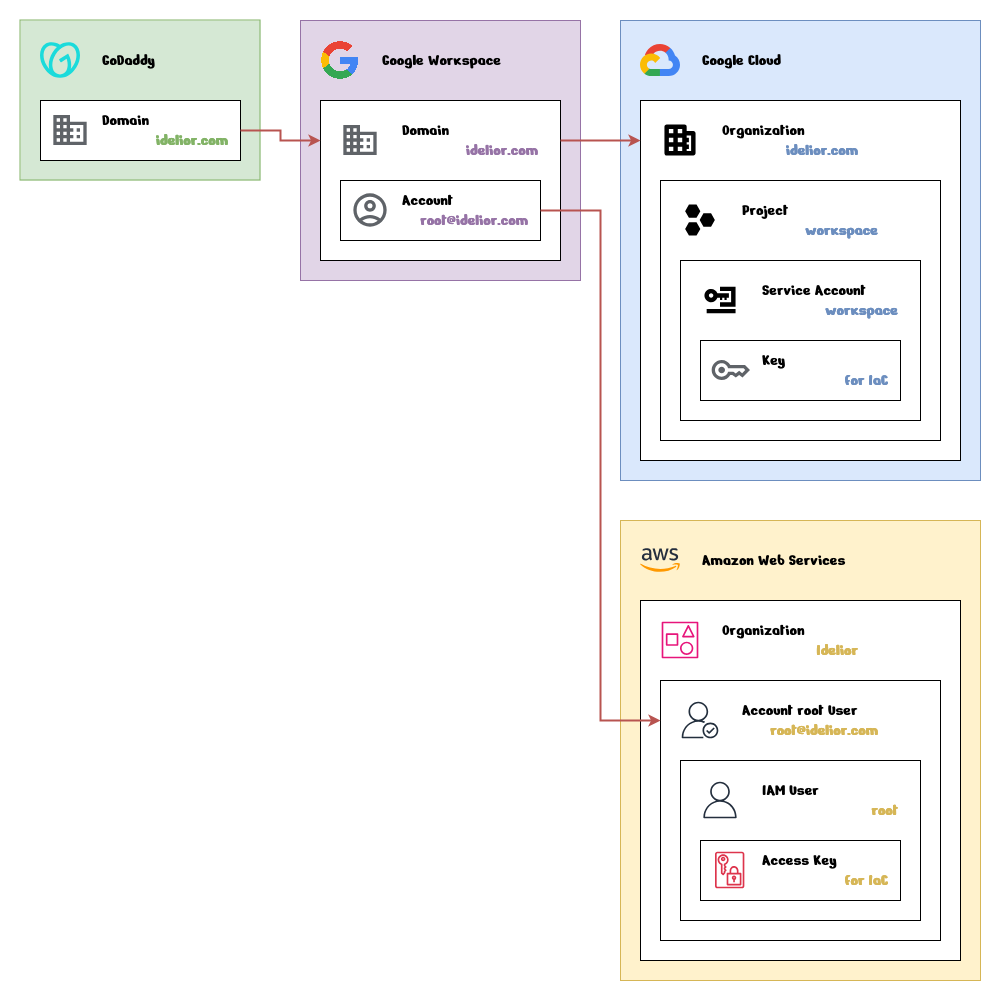

> **Note**: The document is currently drafted temporarily and is not yet complete.

# Initialization

This document outlines the initial setup steps required to establish the foundational infrastructure for the **Idelior** e-commerce platform. These steps are essential to prepare the environment for further configuration and deployment.

## Architecture

### Diagram



### Components

- **Domain (`idelior.com`, in GoDaddy):** Manages basic domain settings and integrates with Google Workspace, Google Cloud, and Amazon Web Services (AWS).

- **Domain (`idelior.com`, in Google Workspace):** Enables the use of `@idelior.com` email addresses.

- **Account (`root@idelior.com`, at Domain):** Primary account for managing all components and services.

- **Organization (`idelior.com`, in Google Cloud):** Centralized container for managing resources in Google Cloud.

- **Project (`workspace`, within Organization):** Independent workspace in Google Cloud for organizing and managing resources, storing Infrastructure as Code (IaC) credentials for Google Workspace.

- **Service Account (`workspace`, within Project):** Programmatic account for managing Google Workspace through IaC.

- **Key (`for IaC`, on Service Account):** Authentication key for IaC in Google Cloud.

- **Organization (`Idelior`, in Amazon Web Services):** Central container for managing multiple AWS accounts.

- **Account root User (`root@idelior.com`, within Organization):** Primary root account for AWS, created using the Google Workspace administrator account.

- **IAM User (`root`, under Account root User):** Programmatic access-only account for IaC in AWS.

- **Access Key (`for IaC`, on IAM User):** Authentication key for IaC in AWS.

## Objectives
  
- **Security:** Using Google Workspace and AWS IAM enhances security by restricting access to critical systems, ensuring that only authorized users can interact with key resources.

- **Automation:** IaC tools like Terraform automate resource management, minimizing manual errors and enabling faster deployments while maintaining consistency.

## Steps

### 1. Domain Purchase through GoDaddy

**Domain Name:** `idelior.com`

The domain `idelior.com` was chosen because it's short, easy to remember, and effectively represents the brand identity.

Purchasing a domain is a crucial step in building cloud infrastructure, as it serves as the foundation for web hosting, DNS settings, and other services. It also enables cloud integration and ensures a stable operational environment.

**Why GoDaddy?**

GoDaddy offered the most affordable option, with features like free domain privacy protection and simple integration with other services.

**Challenges Faced:**

Initially, Terraform was planned for automating DNS management via GoDaddy's API.
    
However, GoDaddy’s API is only available to enterprise customers or those managing over 50 domains. Due to this limitation, DNS management is now handled manually through GoDaddy’s control panel, which still provides the necessary functionality, though less automated.

### 2. Sign up for Google Workspace

**Domain Verification:** `idelior.com` (Verify the domain through GoDaddy’s DNS settings)

To establish a robust communication and collaboration system for the organization, a platform that supports not only professional email but also seamless collaboration tools was required.

**Why Google Workspace?**

The primary reason for choosing Google Workspace was Gmail. Gmail is widely used because it’s reliable, familiar, and provides strong spam filtering and security features.

Also, it seamlessly integrates with other Google services like Drive, Calendar, and Meet, making collaboration easier and boosting productivity.

**Administrator Account:** `root@idelior.com`

The `root@idelior.com` account is designated for IaC processes and automated tasks, and not for personal use. To enhance security and clearly separate roles, individual user accounts were created for team members instead of using shared accounts.

### 3. Sign up Google Cloud

**Organization:** `idelior.com` (automatically processed)

Using Terraform to manage Google Workspace directory services as code provides several benefits:
- It simplifies tracking changes.
- It ensures consistent configurations.
- It reduces human errors and improves operational efficiency through automation.

To manage the infrastructure as code, authentication and authorization settings need to be configured. This involves generating programmatic credentials through Google Cloud by activating the necessary APIs and assigning relevant permissions.

For more details, refer to the following links:
- [Develop on Google Workspace](https://developers.google.com/workspace/guides/get-started)
- [Google Workspace Provider](https://registry.terraform.io/providers/hashicorp/googleworkspace/latest/docs)

> **Note:** During the Google Cloud sign-up process, the organization is automatically set up. There’s no need for further actions as project creation and credential configuration will be handled in the "8. Execute Script" step.

### 4. Assign Roles

**Administrator Account:** `root@idelior.com`

**Organization:** `idelior.com`

**Roles:**
- Organization Administrator (`roles/resourcemanager.organizationAdmin`)
- Project Creator (`roles/resourcemanager.projectCreator`)

To automatically configure components in Google Cloud, the necessary permissions must be granted to the `root@idelior.com` account.

### 5. Sign up Amazon Web Services

**Email:** `root@idelior.com`

To build a scalable and flexible cloud-native infrastructure, leveraging a reliable cloud service provider is essential. A cloud-native approach ensures that the platform can easily scale, adapt to changes, and integrate with various cloud-based tools and services.

**Why AWS?**

AWS is the global leader in cloud computing, trusted by businesses of all sizes for its proven reliability and continuous innovation. With services like EC2, S3, and RDS, AWS provides the advanced infrastructure necessary to support modern businesses like Idelior, ensuring access to the latest technologies.

### 6. Create temporary IAM User and Access Key

The reason for creating a temporary IAM user and access key is to ensure that the necessary permissions are available during the setup phase.

This temporary solution will be replaced by Terraform for complete infrastructure management.

### 7. Attach Policy

**Policy:** AdministratorAccess (`arn:aws:iam::aws:policy/AdministratorAccess`)

To automatically configure components in AWS, the necessary permissions must be granted to the temporary IAM user.

### 8. Execute Script

Before executing the script, ensure that the following tools are installed:
- `gcloud` (Google Cloud CLI)
- `aws` (AWS CLI)
- `terraform` (Terraform)
- `jq` (JSON processor)


The script is designed to streamline the configuration process by taking the temporary settings and completing the necessary configurations as outlined in the architecture diagram.

```bash
$ chmod +x init.sh
$ bash init.sh
```

Once the required values are entered, the script configures the relevant components, ensuring that the infrastructure is set up correctly according to the defined architecture. As part of the process, sensitive information like credentials and access keys are stored in hidden files.

Once the script is executed, it will automatically perform the following tasks to configure the infrastructure:

1. 
